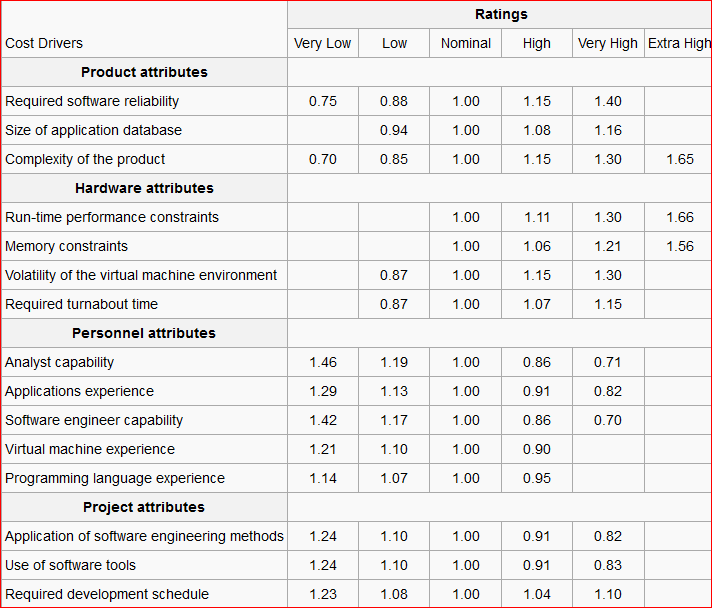

# SDLC<!-- style="text-align:center;" -->

<!-- style="font-size:40px; text-align:center;" -->SoftWare Development Life Cycle

## **SDLC**
SDLC stands for Software Development Life Cycle. SDLC is a process that consists of a series of planned activities to develop or alter the Software Products

Software Development Life Cycle  is  used by the software industry to design, develop and test high quality softwares. The SDLC aims to produce a high-quality software that meets customer expectations, reaches completion within times and cost estimates. 

## **What is SDLC?**

   Software Development Life Cycle, is a structured approach to the development of software applications. The SDLC process is a series of steps or phases that are followed by software development teams to design, develop, test, and deploy software applications.

  The SDLC process typically includes the following stages:

  1.**Planning** : This stage involves defining the project scope, goals, and objectives, as well as identifying the resources, risks, and constraints associated with the project.

  2.**Requirements gathering** : In this stage, the requirements for the software application are gathered from stakeholders, including end-users, clients, and other relevant parties.

  3.**Design** : The design stage involves creating a detailed plan for the software application, including the system architecture, database design, and user interface design.

  4.**Development** : During the development stage, the software code is written and the application is built according to the design specifications.

  5.**Testing** : Once the software application is built, it undergoes a series of tests to ensure that it meets the functional, performance, and security requirements.

  6.**Deployment** : The software application is deployed to the production environment, and the end-users begin to use it.

  7.**Maintenance** : After the software application is deployed, it requires ongoing maintenance, updates, and support to ensure that it continues to meet the changing needs of the users.

<!-- style = "width:450px;height:300px;margin-left:250px;"-->

## SDLC Models

 There are various software development life cycle models defined and       designed which are followed during the software development process. These models are also referred as Software Development Process Models". Each process model follows a Series of steps unique to its type to ensure success in the process of software development.

 Here,are the some important models, 

 1.**WaterFall Model**

 2.**Iterative Model**

 3.**Spiral Model**

 4.**V-Model**

 5.**Big-Bang Model**

 6.**Incremental model**

 7.**Agile Model**

 8.**Prototype Model**

 9.**RAD Model**

### WaterFall Model

The Waterfall Model was the first Process Model to be introduced. It is also referred to as a linear-sequential model cycle.
In a waterfall model, each phase must be completed before the next phase can begin and there is no overlapping in the phases.
The waterfall Model illustrates the software development process in a linear sequential flow. This means that any phase in the development process begins only if the previous phase is complete.
In this waterfall model, the phases do not overlap.
In The Waterfall approach, the whole process of software development is divided into separate phases.
In this Waterfall model, typically, the outcome of one phase acts as the input for the next phase sequentially.

The sequential phases in Waterfall model are −

1.**Requirement Gathering and analysis** − All possible requirements of the system to be developed are captured in this phase and documented in a requirement specification document.

2.**System Design** − The requirement specifications from first phase are studied in this phase and the system design is prepared. This system design helps in specifying hardware and system requirements and helps in defining the overall system architecture.

3.**Implementation** − With inputs from the system design, the system is first developed in small programs called units, which are integrated in the next phase. Each unit is developed and tested for its functionality, which is referred to as Unit Testing.

4.**Integration and Testing**  − All the units developed in the implementation phase are integrated into a system after testing of each unit. Post integration the entire system is tested for any faults and failures.

5.**Deployment of system** − Once the functional and non-functional testing is done; the product is deployed in the customer environment or released into the market.

6.**Maintenance** − There are some issues which come up in the client environment. To fix those issues, patches are released. Also to enhance the product some better versions are released. Maintenance is done to deliver these changes in the customer environment

<!-- style = "width:450px;height:300px;margin-left:250px;"-->

All these phases are cascaded to each other in which progress is seen as flowing steadily downwards through the phases. The next phase is started only after the defined set of goals are achieved for previous phase and it is signed off, so the name "Waterfall Model".

**Pros of WaterFall Model**

1.Simple and easy to understand and use

2.This model is simple to implement also the number of resources that are required for it is minimal.

3.The requirements are simple and explicitly declared; they remain unchanged during the entire project development.

4.The start and end points for each phase is fixed, which makes it easy to cover progress.

5.The release date for the complete product, as well as its final cost, can be determined before development.

6.It gives easy to control and clarity for the customer due to a strict reporting system.

**Cons of WaterFall Model**

1.In this model, the risk factor is higher, so this model is not suitable for more significant and complex projects.

2.This model cannot accept the changes in requirements during development.

3.It becomes tough to go back to the phase. For example, if the application has now shifted to the testing phase, and there is a change in coding, It becomes tough to go back and change it.

4.Since the testing done at a later stage, it does not allow identifying the challenges and risks in the earlier phase, so the risk reduction strategy is difficult  to prepare.

### Iterative Model

In this Model, you can start with some of the software specifications and develop the first version of the software. After the first version if there is a need to change the software, then a new version of the software is created with a new iteration. Every release of the Iterative Model finishes in an exact and fixed period that is called iteration. The Iterative Model allows the accessing earlier phases, in which the variations made respectively. The final output of the project renewed at the end of the SDLC process.

  The Iterative model includes the following phases –

1.**Requirement gathering & analysis** : In this phase, requirements are gathered from customers and check by an analyst whether requirements will fulfil or not. Analyst checks that need will achieve within budget or not. After all of this, the software team skips to the next phase.

2.**Design** : In the design phase, team design the software by the different diagrams like Data Flow diagram, activity diagram, class diagram, state transition diagram, etc.

3.**Implementation** : In the implementation, requirements are written in the coding language and transformed into computer programmes which are called Software.

4.**Testing** : After completing the coding phase, software testing starts using different test methods. There are many test methods, but the most common are white box, black box, and grey box test methods.

5.**Deployment** : After completing all the phases, software is deployed to its work environment.

6.**Review**: In this phase, after the product deployment, review phase is performed to check the behaviour and validity of the developed product. And if there are any error found then the process starts again from the requirement gathering.

7.**Maintenance**: In the maintenance phase, after deployment of the software in the working environment there may be some bugs, some errors or new updates are required. Maintenance involves debugging and new addition options.

<!-- style = "width:450px; height:300px; margin-left:250px;"-->

**Pros of Iterative Model**

1.Testing and debugging during smaller iteration is easy.

2.A Parallel development can be planned.

3.Results are obtained early and periodically.

4.Risks are identified and resolved during iteration.

5.Issues, challenges and risks identified from each increment can be utilized/applied to the next increment.

**Cons of Iterative Model**

1.It is not suitable for smaller projects.

2.More Resources may be required.

3.Design can be changed again and again because of imperfect requirements.

4.Requirement changes can cause over budget.

5.Project completion date not confirmed because of changing requirements.

### Spiral Model
The Spiral model is a combination of iterative development process model and the waterfall model with a very high significance on risk analysis. It implements the potential for rapid development of new versions of the software. Using the spiral model, the software is developed in a series of incremental releases. During the early iterations, the additional release may be a paper model or prototype. During later iterations, more and more complete versions of the engineered system are produced.

The Spiral Model Includes the following phases:-

1.**Objective setting**: Each cycle in the spiral starts with the identification of purpose for that cycle, the various alternatives that are possible for achieving the targets, and the constraints that exists.

2.**Risk Assessment and reduction**: The next phase in the cycle is to calculate these various alternatives based on the goals and constraints. The focus of evaluation in this stage is located on the risk perception for the project.

3.**Development and validation**:The next phase is to develop strategies that resolve uncertainties and risks. This process may include activities such as benchmarking, simulation, and prototyping.

4.**Planning**: Finally, the next step is planned. The project is reviewed, and a choice made whether to continue with a further period of the spiral. If it is determined to keep, plans are drawn up for the next step of the project.

<!-- style = "width:450px;height:300px;margin-left:250px;"-->

Based on the customer evaluation, the software development process enters the next iteration and subsequently follows the linear approach to implement the feedback suggested by the customer. The process of iterations along the spiral continues throughout the life of the software.

**Pros of Spiral Model**

1.Changing requirements can be accommodated.

2.Allows extensive use of prototypes.

3.Requirements can be captured more accurately.

4.Users see the system early

**Cons of Spiral Model**

1.Management is more complex.

2.End of the project may not be Known early.

3.Not suitable for small or low risk projects and could be expensive for small projects.

4.Process is complex.

5.Spiral may go on indefinitely.

6.Large number of intermediate stages requires excessive documentation.

### V-Model
V-model also referred to as the Verification and Validation Model. In this, each phase of SDLC must complete before the next phase starts. It follows a sequential design process same as the waterfall model. Testing of the device is planned in parallel with a corresponding stage of development.

**Verification**: It involves a static analysis method (review) done without executing code. It is the process of evaluation of the product development process to find whether specified requirements meet.

**Validation**: It involves dynamic analysis method (functional, non-functional), testing is done by executing code. Validation is the process to classify the software after the completion of the development process to determine whether the software meets the customer expectations and requirements.

So V-Model contains Verification phases on one side of the Validation phases on the other side. Verification and Validation process is joined by coding phase in V-shape. Hence it is known as V-Model.

<!-- style = "width:450px;height:300px; margin-left:250px;"-->

 The verification of V-model include the following phases:-

1.**Business requirement analysis**: This is the first step where product requirements understood from the customer's side. This phase contains detailed communication to understand customer's expectations and exact requirements.

2.**System Design**: In this stage system engineers analyze and interpret the business of the proposed system by studying the user requirements document.

3.**Architectural Design**: Architectural features are understood and designed at this stage. More than one technical approach is usually proposed, and a final decision is made based on technical and financial feasibility. System design is further broken down into modules taking different functionality. It is also known as High-Level Design (HLD).

4.**Module Design**: In this step, a detailed internal design is specified for all system modules, referred to as low-level design (LLD). The design must be compatible with other modules and other external systems in the system architecture. Unit testing is an essential part of any development process and helps to eliminate maximum faults and errors at a very early stage. These unit testing can be designed at this level based on internal module design.

5.**Coding**: The actual coding of the system modules designed in the design phase is taken up in the Coding phase. The most appropriate programming language is decided based on the system and architectural requirements.

The Verification of V-Model include the following steps:-

1.**Unit Testing**: In the V-Model, Unit Test Plans (UTPs) are developed during the module design phase. These UTPs are executed to eliminate errors at code level or unit level. A unit is the smallest entity which can independently exist, e.g., a program module. Unit testing verifies that the smallest entity can function correctly when isolated from the rest of the codes/ units.

2.**Integration Testing**: Integration Test Plans are developed during the Architectural Design Phase. These tests verify that groups created and tested independently can coexist and communicate among themselves.

3.**System Testing**: System Tests Plans are developed during System Design Phase. Unlike Unit and Integration Test Plans, System Tests Plans are composed by the client?s business team. System Test ensures that expectations from an application developer are met.

4.**Acceptance Testing**: Acceptance testing is related to the business requirement analysis part. It includes testing the software product in user atmosphere. Acceptance tests reveal the compatibility problems with the different systems, which is available within the user atmosphere. It conjointly discovers the non-functional problems like load and performance defects within the real user atmosphere.

**Pros of the V-Model**

1.It is a highly-disciplined model, and the steps are completed at once.

2.Works well for small projects where the requirements are very well understood.

3.Easy to understand and use.

4.It is easy to manage due to the rigor of the model.

**Cons of the V-Model**

1.This model is not suitable for complex and object-oriented projects.

2.This model is not appropriate for long and ongoing projects.

3.Not suitable for projects where there is a high to moderate risk of changing requirements.

4.Once the software is in the testing phase, it is difficult to go back and make modifications.

5.No working software is produced late during the life cycle.

### Big-Bang Model
The Big Bang model is an SDLC model where we do not follow any specific process. The development just starts with the required money and efforts as the input, and the output is the software developed which may or may not be as per customer requirement. This Big Bang Model does not follow a procedure and there is a very little planning required. Even the customer is not sure about what exactly he wants and the requirements are implemented on the fly without much analysis.

This model is ideal for small projects like academic projects or practical projects. One or two developers can work together on this model.

**When to use Big-Bang model ?**

As we discussed above, this model is required when this project is small like an academic project or a practical project. This method is also used when the size of the developer team is small and when requirements are not defined, and the release date is not confirmed or given by the customer.

**Pros of Big-Bang  Model**

1.There is no planning required.

2.Simple Model.

3.Few resources required.

4.Easy to manage.

5.Flexible for developers.

**Cons of Big-Bang Model**

1.There are high risk and uncertainty.

2.Not acceptable for a large project.

3.If requirements are not clear that can cause very expensive.

### Incremental Model

Incremental Model is a process of software development where requirements divided into multiple standalone modules of the software development cycle. In this model, each module goes through the requirements, design, implementation and testing phases. Every subsequent release of the module adds function to the previous release. The process continues until the complete system achieved.

The  Incremental Model includes the following steps:- 

1.**Requirement analysis**:In the first step of the incremental model, the product analysis expertise identifies the functional requirements and non-functional requirements. This stage plays an important role while developing software under the gradual method.

2.**Design & Development**:In this phase of the SDLC's incremental model, the system functionality and design of the development methodology has ended with success. When the software develops new practicality, the incremental model uses the design and development phase.

3.**Testing**:In the incremental model, the testing phase examines the performance of each existing function as well as additional functionality. In the testing phase, different methods are used to test the behavior of each task.

4.**Implementation**:In the implementation phase, coding is done for developing software. The design of the software, which is made in the designing phase, is now implemented practically, and final coding is done. Upon completion of this process, the quality of the product working will be enhanced and upgrade to the final system product.

<!-- style = "width:450px; height:300px; margin-left:250px;"-->

**Pros of Incremental Model**

1.Errors are easy to detect.

2.Easy to test and debug.

3.Flexible.

4.Easy to manage risk because it has been managed through iteration.

5.The client is provided with significant functionality at an early stage.

**Cons of Incremental Model**

1.It needs good planning.

2.The total cost is high.

3.It needs well-defined module interfaces.

### Agile Model

Agile SDLC model is a combination of iterative and incremental process models with focus on process adaptability and customer satisfaction by rapid delivery of working software product. Agile Methods break the product into small incremental builds. These builds are provided in iterations. Each iteration typically lasts from about one to three weeks. Every iteration involves cross functional teams working simultaneously on various areas like −

* Planning
* Requirements Analysis
* Design
* Coding
* Unit Testing and
* Acceptance Testing.

At the end of the iteration, a working product is displayed to the customer and important stakeholders.

The Agile Modle includes the following steps :

1.Requirements gathering

2.Design the requirements

3.Construction/ iteration

4.Testing

5.Deployment

6.Feedback

1.**Requirements gathering**: In this phase, you must define the requirements. You should explain business opportunities and plan the time and effort needed to build the project. Based on this information, you can evaluate technical and economic feasibility.

2.**Design the requirements**: When you have identified the project, work with stakeholders to define requirements. You can use the user flow diagram or the high-level UML diagram to show the work of new features and show how it will apply to your existing system.

3.**Construction/ iteration**: When the team defines the requirements, the work begins. Designers and developers start working on their project, which aims to deploy a working product. The product will undergo various stages of improvement, so it includes simple, minimal functionality.

4.**Testing**: In this phase, the Quality Assurance team examines the product's performance and looks for the bug.

5.**Deployment**: In this phase, the team issues a product for the user's work environment.

6.**Feedback**: After releasing the product, the last step is feedback. In this, the team receives feedback about the product and works through the feedback.

<!-- style = "width:450px;height:300px;margin-left:250px;"-->

**Pros of Agile Model**

1.Is a very realistic approach to software development.

2.Promotes teamwork and cross training.

3.Functionality can be developed rapidly and demonstrated.

4.Resource requirements are minimum.

5.Suitable for fixed or changing requirements.

6.Delivers early partial working solutions.

7.Good model for environments that change steadily.

8.Minimal rules, documentation easily employed.

**Cons of Agile Model**

1.Not suitable for handling complex dependencies.

2.More risk of sustainability, maintainability and extensibility.

3.Depends heavily on customer interaction, so if customer is not clear, team can be driven in the wrong direction.

4.There is a very high individual dependency, since there is minimum documentation generated.

### Prototype Model

Making a functional replica of a system or product that needs to be engineered is known as prototyping. Prototyping Model involves building, testing, and refining prototypes until one is good enough. It provides a scaled-down replica of the final product and is employed for gathering customer feedback. The typical outcome of a prototype is that it is a relatively unpolished rendition of the real system, possibly displaying constrained functional capabilities, poor dependability, and ineffective performance in comparison to the real software. Additionally, it builds a foundation upon which to build the finished software or system. When the project’s requirements are not fully understood, it functions optimally.

The Prototype Model includes the following steps :-

1.**Gathering and analyzing requirements**: Analysis of requirements is the first step in a prototype model. The system requirements are specifically determined during this phase. The system’s users are questioned throughout the process to learn what they anticipate from the system.

2.**Rapid design**: A rapid design or rough design constitutes the second prototype model phases. At this point, the system’s basic design is created. It is not, however, a fully realized design. It provides the user with a quick overview of the system. The prototype’s development is aided by the rapid design.

3.**Construct a Prototype**: This stage involves designing a real prototype using the data from rapid design. The system is a scaled-down working model.

4.**Perform a preliminary user assessment**: At this point, the client is given the suggested system for a preliminary assessment. Knowing the working model’s advantages and disadvantages is helpful. Customer feedback is gathered, and it is given to the developer.

5.**Fine-tuning the prototype**: If the user is not pleased with the present prototype, you must improve the prototype in response to their comments and recommendations. Until all of the user’s criteria are satisfied, this phase won’t be considered complete. A final system is created based on the final prototype that has been accepted once the user is satisfied with the developed prototype.

6.**Implement and maintain the product**: Following comprehensive testing, the final system is put into production after being created based on the final prototype. To reduce downtime and avoid catastrophic breakdowns, the system is regularly maintained.

<!-- style = "width:450px;height:300px;margin-left:250px;"-->

 Prototype Types

There are different types of software prototypes used in the industry. 

**Throwaway/Rapid Prototyping**

Throwaway prototyping is also called as rapid or close ended prototyping. This type of prototyping uses very little efforts with minimum requirement analysis to build a prototype. Once the actual requirements are understood, the prototype is discarded and the actual system is developed with a much clear understanding of user requirements.

**Evolutionary Prototyping**

Evolutionary prototyping also called as breadboard prototyping is based on building actual functional prototypes with minimal functionality in the beginning. The prototype developed forms the heart of the future prototypes on top of which the entire system is built. By using evolutionary prototyping, the well-understood requirements are included in the prototype and the requirements are added as and when they are understood.

**Incremental Prototyping**

Incremental prototyping refers to building multiple functional prototypes of the various sub-systems and then integrating all the available prototypes to form a complete system.

**Extreme Prototyping**
Extreme prototyping is used in the web development domain. It consists of three sequential phases. First, a basic prototype with all the existing pages is presented in the HTML format. Then the data processing is simulated using a prototype services layer. Finally, the services are implemented and integrated to the final prototype. This process is called Extreme Prototyping used to draw attention to the second phase of the process, where a fully functional UI is developed with very little regard to the actual services.

**Pros of Prototype Model**

1.Reduce the risk of incorrect user requirement.

2.Good where requirement are changing/uncommitted.

3.Regular visible process aids management.

4.Support early product marketing.

5.Reduce Maintenance cost.

6.Errors can be detected much earlier as the system is made side by side.

**Cons of Prototype Model**

1.An unstable/badly implemented prototype often becomes the final product.

2.Require extensive customer collaboration.

3.Difficult to know how long the project will last.

4.Easy to fall back into the code and fix without proper requirement analysis, design, customer evaluation, and feedback.

5.Prototyping tools are expensive.

6.Special tools & techniques are required to build a prototype.

7.It is a time-consuming process.

### RAD Model

The RAD (Rapid Application Development) model is based on iterative prototyping and iterative development without involving any specific planning. The process of developing the software itself requires the planning necessary for product development. Rapid application development aims to gather customer needs through workshops or focus teams, initial testing of iterations, using iterative models, reusing existing designs, continuous integration, and faster delivery. If the requirements are well understood and described, and the project scope is a constraint, the RAD process enables a development team to create a fully functional system within a concise time period.

The RAD model includes the following steps :-

1.**Business Modelling**:  In this phase of development business model should be designed based on the information available from different business activities. Before start the development there should be a complete picture of business process functionality.

2.**Data Modelling**: The data collected from business modeling is refined into a set of data objects (entities) that are needed to support the business. The attributes (character of each entity) are identified, and the relation between these data objects (entities) is defined.

3.**Process Modelling**: The information object defined in the data modeling phase are transformed to achieve the data flow necessary to implement a business function. Processing descriptions are created for adding, modifying, deleting, or retrieving a data object.

4.**Application Modeling**: In this phase application id developed and coding completed. With help of automation tools all data implemented and processed to work as real time.

5.**Testing & Turnover**: Many of the programming components have already been tested since RAD emphasis reuse. This reduces the overall testing time. But the new part must be tested, and all interfaces must be fully exercised.

<!-- style = "width:450px;height:300px;margin-left:250px;"-->

**Pros of RAD Model**

1.Fast application development and delivery.

2.Less testing activity required.

3.Visualization of progress.

4.Less resources required.

5.Review by the client from the very beginning of development so very less chance to miss the requirements.

6.Very flexible if any changes required.

7.Cost effective.

8.Good for small projects.

**Cons of RAD Model**

1.High skilled resources required.

2.On each development phase client’s feedback required.

3.Automated code generation is very costly.

4.Difficult to manage.

5.Not a good process for long term and big projects.

## SoftWare Management 

### Project Management 

 **What is Software Project**

Project is a well-defined task, which is a collection of several operations done in order to achieve a goal. Projects can vary from simple to difficult and can be run by one person or hundreds. The project manager or team executive describes and approves the projects.A Software Project is the complete procedure of software development from requirement gathering to testing and maintenance, carried out according to the execution methodologies, in a specified period of time to achieve intended software product.

**What is Software Mangement**

Software project management is a way of planning and supervising software projects in a disciplined manner. In software project management, software projects are planned, implemented, monitored, and controlled. It is a method for managing and scheduling resources for software development that meet needs. In software project management, customers and developers need to know the duration and cost of a project.

**Need for Software Management**

There are three software project management needs,

1.Time

2.Cost

3.Quality

Delivering a high-quality product is an essential part of the software organization while keeping costs within the client's budget and delivering the project on time. There are many factors, external and internal, which may affect these three factors. Any of three-factor can severely affect the other two.

**Product Manager**

The project manager is the person who has overall responsibility for planning, designing, implementing, monitoring, controlling, and closure of a project. Project managers play a key role in the achievement of projects.
The project manager is responsible for making decisions. The project manager is used to managing risk and reduce uncertainty. Every decision made by the project manager must directly beneficial for their project.

**Role of Product Manager**

1.Managing risks and issues.

2.Create the project team and assigns tasks to several team members.

3.Activity planning and sequencing.

4.Monitoring and reporting progress.

5.Modifies the project plan to deal with the situation.

### Activities

Software Project Management consists of many activities, that includes planning of the project, deciding the scope of product, estimation of cost in different terms, scheduling of tasks, etc.

1.Project Planning

2.Scope Management

3.Project Estimation

4.Software size estimation

5.Effort estimation

6.Time estimation

7.Cost estimation

**Project planning**

Software project planning is work that is done before the production of software starts. It is for software products but does not involve any concrete activity that has any relationship with software production. It is a set of multiple processes that facilitate software production.

**Scope Management** 

It defines the scope of the project; It includes all activities, the process required to create a deliverable software product. Scope management is necessary because it clearly defines what will and will not be done in the project. This makes the project to include limited and quantitative tasks, which can be easily documented and in turn, avoids cost and time.

These are the points necessary during project scope manegement

1.Define the scope.

2.Decide when to control and verify.

3.Split the project into various smaller parts for ease of management.

4.Scope verification.

5.Monitor the scope by adding changes to the scope.

**Project Estimation**

Accurate estimation of various measures is essential for effective management. With the right estimates, managers can manage and control the project more efficiently and effectively.

**Software size estimation**

Estimating the size of the software can be in KLOC (Kilometer lines of code) or by counting the number of function points in the software. The number of lines of code depends on the coding practices and function points according to customer or software requirements.

**Effort estimation**

Managers estimate the effort required in terms of time and manpower required to produce the software. The size of the software for estimating effort must be known. This can be achieved either by the experience of the managers, the historical data of the organization, or the software size that can be converted into efforts using some standard formulas.

**Time estimation**

When the effort and size assessed, then the time needed to develop the software can be estimated. The required efforts are separated into sub-categories according to the requirement specifications and interdependencies of the various components of the software. Work Breakthrough Structure is used to divide tasks into smaller tasks.

**Cost estimation**

This can be considered the most difficult. To estimate the cost of the project, one must consider it.

1.Size and quality of the software.

2.Hardware.

3.Expenses involved in travel, communication, training, and support.

## Project Planning

Project planning is a management process that focuses on the activities required to complete a project successfully. Project planning helps to prevent problems that occur during the project development, such as a change in the project, non-availability of resources, etc. Project planning helps in better utilization of resources and time.

### Software Project Planning

A Software Project is the complete methodology of programming advancement from requirement gathering to testing and support, completed by the execution procedures, in a specified period to achieve intended software product.

**Need for Software Mangement**

Project planning is very important for the success of the project. Making the right plan from the beginning of the project planning helps to avoid big mistakes. It assures that the implementation of the project will meet its goal on time and within the budget. Resource requirement is estimated based on cost and development time. The project schedule can be very useful for controlling and monitoring the progress of the project. Project development depends on resource and development time.

**Software Project Manager**

Software manager is responsible for planning and scheduling project development. They manage the work to ensure that it is completed to the required standard. They monitor the progress to check that the event is on time and within budget. The project planning must incorporate the major issues like size & cost estimation scheduling, project monitoring, personnel selection evaluation & risk management. To plan a successful software project, we must understand:

1.Scope of work to be completed.

2.Risk analysis.

3.The resources mandatory.

4.The project to be accomplished.

5.Record of being followed.

**Steps for project planning**

Planning is the basic step of project planning that every project manager needs to know. This gives an idea of what is happening at different phases while developing software, but they do not provide detail information.

At the beginning of any project, the project manager does not have any plan. To develop a good plan for the project, the project manager needs to spend some time with the team members and explain what he wants to achieve together and work on the processes required to achieve the goal. The project manager develops an action plan for how it will be carried out.

**How to manage your plan**

The project plan is not static; it can be modified according to the needs of the customer. A project manager is always free to make a change whenever it is needed. It may be possible that the project schedule will change almost daily, but mostly the delivery date and cost management processes do not change during the life of the project.

Sometimes it happens that some plans are not working accordingly, then the project manager needs to find alternatives and chooses the best one among them. Make the changes you need, re-approve the changes, and implement it.

### Software cost estimation
For any new software project, it is necessary to know how much it will cost to develop and how much development time will it take. These estimates are needed before development is initiated, but how is this done? Several estimation procedures have been developed and are having the following attributes in common.

1.Project scope must be established in advanced.

2.Software metrics are used as a support from which evaluation is made.

3.The project is broken into small PCs which are estimated individually.To achieve true cost & schedule estimate, several option arise.

4.Delay estimation

5.Used symbol decomposition techniques to generate project cost and schedule estimates.

6.Acquire one or more automated estimation tools.

**Uses of cost estimation**

1.During the planning stage, one can choose how many engineers are required for the project and to develop the schedule.

2.In monitoring the project's progress, one needs to access whether the project is progressing according to the  procedure and takes corrective action, if necessary.

### COCOMO Model

The constructive cost model (COCOMO) is one of the most widely used software cost estimation models. This model is developed by B.W.Boehm in 1981. COCOMO model is based on LOC, i.e., the number of lines of code. This model can be classified into three categories basic, intermediate, and detailed sub-models.

These are the essential parameter of COCOMO which is responsible for the quality of any software product:

**Effort**: The number of labor required to complete the work. It is measured in person-months units.

**Schedule**: The amount of time required to complete the work is directly proportional to the effort. It is measured in the unit of time, for example, months, and weeks.

Various models of COCOMO have been introduced to predict cost estimates at different levels. All the models are applied to different projects according to the requirements.

Software projects are classified into three categories:

* Organic

* Semi-detached

* Embedded

**Organic**: In the organic type, the project deals with developing a well-understood application program; the team size is generally small. This category is for the small to medium size software product. In this type, team members have good experience and knowledge. 

**Semi-detached**: In the semi-detached type, the essential elements are team-size, experience, knowledge of the multiple programming languages. The projects that come under the semi-detached are less familiar and hard to develop. It also requires better guidance, more experienced developers.

**Embedded**: In the embedded type, a software project requires the highest level of complexity, creativity, and experience. In this category, the larger team size is needed as compared to the previous models. 

**Basic COCOMO Model**

This model is based on Lines of code. The basic COCOMO model helps to calculate a quick estimation of software development costs. The accuracy of this model is considerably restricted because of the insufficient factor considerations. The Basic COCOMO model’s expression is given as:

Effort (E) = a*(KLOC)b 

Development Time (Tdev) = c*(E)d 

Where,

KLOC is Kilo's lines of code.
E is the Effort applied in person-month.
Tdev is the development time in months.
The coefficient a,b,c & d are constant and can be calculated using the given table:

|Project      |	a	|b  	|c	 |  d    |
| :-----      | :---|:------|:---|:------| 
|Organic      |	2.4	|1.05	|2.5 | 0.38	 |
|Semi-detached|3.0  |1.12   |2.5 |0.35   | 
|Embedded     |3.6  | 1.20  |2.5 |0.32   |
 
When we calculate effort and development time, then the average staff size to complete the project should be calculated as:

Average staff size (SS)  = E/Tdev persons
When the project size is calculated, then we will have to calculate productivity level
Productivity (P) = KLOC/E

**Intermediate Model**

The basic COCOMO model assumes that effort is the only factor, which calculates the number of lines of code and constants with respect to the multiple software systems. The intermediate COCOMO model refines the initial estimate. This estimate is obtained through the basic COCOMO expressions with the help of a set of fifteen cost drivers, based on various attributes of software development. Boehm requires the project manager to rate these fifteen different parameters for a particular project on a scale of one to three. Then based on these three ratings, he suggests an appropriate cost driver value to be multiplied with the initial estimate that was obtained from the basic COCOMO model.

In general, cost drivers can be grouped into four categories:

**Product attributes**

* Required software reliability extent (RELY)

* Size of the application database (DATA)

* The complexity of the product (CPLX)

**Hardware attributes**

* Run-time performance constraints (TIME)

* Memory constraints (STOR)

* The volatility of the virtual machine environment (VIRT)

* Required turnaround time (TIME)

 **Personnel attributes**

* Analyst capability (ACAP)

* Programmer capability (PCAP)

* Applications experience (AEXP)

* Virtual machine experience (VEXP)

* Programming language experience (LEXP)

**Project attributes**

* Use of software tools (TOOL)

* Modern programming practices (MODP)

* Required development schedule (SCED)

<!-- style = "width:550px; height:400px;margin-left:180px;"-->

 **Detailed Model**

In detailed COCOMO, a large amount of work has been done by Boehm to cover all essential aspects of software development. It offers a medium to process all the project characteristics for calculating the software estimation. The detailed model introduces two more capabilities that are as follows:

**Phase-sensitive effort multiplier**:Some phases (like design, programming, integration/test) are more affected than others by factors defined by the cost drivers. The detailed model provides a set of phase-sensitive effort multipliers for each cost driver. This helps in determining the workforce allocation for each phase of the project.

**Three-level product hierarchy**: In the three-level product hierarchy, there are a module, subsystem, and system levels. The ratings of the cost driver are done at an appropriate level, i.e., the level at which it is most affected by the variation.

**Development phase**

Software development is done in four phases:

**Plans/requirements**:This is the first phase of the software development life cycle. In this phase, the requirements are analyzed, the product plan is set up, and a full product specification is generated for software development. The developers have to give 6% to 8% of the effort and 10% to 40% of the development time.

**Product design**:In this phase, a software developer starts thinking about "how." How a software UI look like?  How do they function? The software requirements required by the customers are kept in the mind of the designer while designing software. There are two types of designs that are designed by the designer; conceptual design and technical design. Conceptual design tells the customer what the system will exactly do. When the customer approves the design, this process is called validation. Then the conceptual design is converted into a more detailed form of technical design, which helps the developer to understand the hardware and software needs to fulfill the customer's requirement. 

**Programming**:This is the phase where development starts. This phase is divided into two sub-phases: detailed design and code/unit test. This phase requires an effort from 48% to 68% and necessitate 24% to 64% of the development time to finish the coding.

**Integration/Test**:In the integration testing, individual units are combined and tested as a whole. The purpose of this level of testing is to expose faults in the interaction between integrated units.

### Putnam Resource Allocation Model
The Lawrence Putnam model describes the time and effort requires finishing a software project of a specified size. Putnam makes a use of a so-called The Norden/Rayleigh Curve to estimate project effort, schedule & defect rate as shown in fig.

<!-- style = "width:550px;height:400px;margin-left:180px;"-->

 Putnam noticed that software staffing profiles followed the well known Rayleigh distribution. Putnam used his observation about productivity levels to derive the software equation:

 <!-- style = "width:550px; height:100px;margin-left:160px;"-->
 
The various terms of this expression are as follows:

K is the total effort expended (in PM) in product development, and L is the product estimate in KLOC.

td correlate to the time of system and integration testing. Therefore, td can be relatively considered as the time required for developing the product.
Ck Is the state of technology constant and reflects requirements that impede the development of the program.

Typical values of Ck = 2 for poor development environment

Ck= 8 for good software development environment

Ck = 11 for an excellent environment (in addition to following software engineering principles, automated tools and techniques are used).

The exact value of Ck for a specific task can be computed from the historical data of the organization developing it.

Putnam proposed that optimal staff develop on a project should follow the Rayleigh curve. Only a small number of engineers are required at the beginning of a plan to carry out planning and specification tasks. As the project progresses and more detailed work are necessary, the number of engineers reaches a peak. After implementation and unit testing, the number of project staff falls.

Effect of a Schedule change on Cost 

Putnam derived the following expression:

<!-- style = "width:550px;height:100px;margin-left:160px;"-->
                   

Where, K is the total effort expended (in PM) in the product development

L is the product size in KLOC

td corresponds to the time of system and integration testing

Ck Is the state of technology constant and reflects constraints that impede the progress of the program
Now by using the above expression, it is obtained that,

For the same product size, C =L3 / Ck3 is a constant.

(As project development effort is equally proportional to project development cost) 

From the above expression, it can be easily observed that when the schedule of a project is compressed, the required development effort as well as project development cost increases in proportion to the fourth power of the degree of compression. It means that a relatively small compression in delivery schedule can result in a substantial penalty of human effort as well as development cost.

## Risk management 

**What is Risk**

A clear definition of a "Risk" is a problem that could cause some loss or threaten the progress of the project, but which has not happened yet. These potential issues might harm cost, schedule or technical success of the project and the quality of our software device.

### Risk management

Risk Management is the system of identifying addressing and eliminating these problems before they can damage the project.A software project can be concerned with a large variety of risks. In order to be adept to systematically identify the significant risks which might affect a software project, it is essential to classify risks into different classes. The project manager can then check which risks from each class are relevant to the project.

There are three main classifications of risks which can affect a software project:

1.Project risks

2.Technical risks

3.Business risks

1.**Project risks**: Project risks concern differ forms of budgetary, schedule, personnel, resource, and customer-related problems. A vital project risk is schedule slippage. Since the software is intangible, it is very tough to monitor and control a software project. It is very tough to control something which cannot be identified. For any manufacturing program, such as the manufacturing of cars, the plan executive can recognize the product taking shape.

2.**Technical risks**: Technical risks concern potential method, implementation, interfacing, testing, and maintenance issue. It also consists of an ambiguous specification, incomplete specification, changing specification, technical uncertainty, and technical obsolescence. Most technical risks appear due to the development team's insufficient knowledge about the project.

3.**Business risks**: This type of risks contain risks of building an excellent product that no one need, losing budgetary or personnel commitments, etc.

**Principle of risk management**

1.**Global Perspective**: In this, we review the bigger system description, design, and implementation. We look at the chance and the impact the risk is going to have.

2.**Take a forward-looking view**: Consider the threat which may appear in the future and create future plans for directing the next events.

3.**Open Communication**: This is to allow the free flow of communications between the client and the team members so that they have certainty about the risks.

4.**Integrated management**: In this method risk management is made an integral part of project management.

5.**Continuous process**: In this phase, the risks are tracked continuously throughout the risk management paradigm.

 
### Risk Management activities

Risk management consists of three main activities,

**Risk Assessment**
The objective of risk assessment is to division the risks in the condition of their loss, causing potential. For risk assessment, first, every risk should be rated in two methods

1.The possibility of a risk coming true (denoted as r).

2.The consequence of the issues relates to that risk (denoted as s).

Based on these two methods, the priority of each risk can be estimated:

            <!-- style = "text-align:center;" -->        p = r * s 

Where p is the priority with which the risk must be controlled, r is the probability of the risk becoming true, and s is the severity of loss caused due to the risk becoming true. If all identified risks are set up, then the most likely and damaging risks can be controlled first, and more comprehensive risk abatement methods can be designed for these risks.

1.**Risk Identification**: The project organizer needs to anticipate the risk in the project as early as possible so that the impact of risk can be reduced by making effective risk management planning.
A project can be of use by a large variety of risk. To identify the significant risk, this might affect a project. It is necessary to categories into the different risk of classes.

There are different types of risks which can affect a software project:

1.**Technology risks**: Risks that assume from the software or hardware technologies that are used to develop the system.

2.**People risks**: Risks that are connected with the person in the development team.

3.**Organizational risks**: Risks that assume from the organizational environment where the software is being developed.

4.**Tools risks**: Risks that assume from the software tools and other support software used to create the system.

5.**Requirement risks**: Risks that assume from the changes to the customer requirement and the process of managing the requirements change.

6.**Estimation risks**: Risks that assume from the management estimates of the resources required to build the system

2. **Risk Analysis**: During the risk analysis process, you have to consider every identified risk and make a perception of the probability and seriousness of that risk.
There is no simple way to do this. You have to rely on your perception and experience of previous projects and the problems that arise in them.

It is not possible to make an exact, the numerical estimate of the probability and seriousness of each risk. Instead, you should authorize the risk to one of several bands:

1.The probability of the risk might be determined as very low (0-10%), low (10-25%), moderate (25-50%), high (50-75%) or very high (+75%).

2.The effect of the risk might be determined as catastrophic (threaten the survival of the plan), serious (would cause significant delays), tolerable (delays are within allowed contingency), or insignificant.

**Risk Control** 

It is the process of managing risks to achieve desired outcomes. After all, the identified risks of a plan are determined; the project must be made to include the most harmful and the most likely risks. Different risks need different containment methods. In fact, most risks need ingenuity on the part of the project manager in tackling the risk.

There are three main methods to plan for risk management:

1.**Avoid the risk**: This may take several ways such as discussing with the client to change the requirements to decrease the scope of the work, giving incentives to the engineers to avoid the risk of human resources turnover, etc.

2.**Transfer the risk**: This method involves getting the risky element developed by a third party, buying insurance cover, etc.

3.**Risk reduction**: This means planning method to include the loss due to risk. For instance, if there is a risk that some key personnel might leave, new recruitment can be planned.

**Risk Leverage**: To choose between the various methods of handling risk, the project plan must consider the amount of controlling the risk and the corresponding reduction of risk. For this, the risk leverage of the various risks can be estimated.

Risk leverage is the variation in risk exposure divided by the amount of reducing the risk.

Risk leverage = (risk exposure before reduction - risk exposure after reduction) / (cost of reduction)

1.**Risk planning**: The risk planning method considers each of the key risks that have been identified and develop ways to maintain these risks.

For each of the risks, you have to think of the behavior that you may take to minimize the disruption to the plan if the issue identified in the risk occurs.

You also should think about data that you might need to collect while monitoring the plan so that issues can be anticipated.

Again, there is no easy process that can be followed for contingency planning. It rely on the judgment and experience of the project manager.

2.**Risk Monitoring**: Risk monitoring is the method king that your assumption about the product, process, and business risks has not changed.

### Project Scheduling

Project-task scheduling is a significant project planning activity. It comprises deciding which functions would be taken up when. To schedule the project plan, a software project manager wants to do the following:

1.Identify all the functions required to complete the project.

2.Break down large functions into small activities.

3.Determine the dependency among various activities.

4.Establish the most likely size for the time duration required to complete the activities.

5.Allocate resources to activities.

6.Plan the beginning and ending dates for different activities.

7.Determine the critical path. A critical way is the group of activities that decide the duration of the project.

The first method in scheduling a software plan involves identifying all the functions required to complete the project. A good judgment of the intricacies of the project and the development process helps the supervisor to identify the critical role of the project effectively. Next, the large functions are broken down into a valid set of small activities which would be assigned to various engineers. The work breakdown structure formalism supports the manager to breakdown the function systematically after the project manager has broken down the purpose and constructs the work breakdown structure; he has to find the dependency among the activities. Dependency among the various activities determines the order in which the various events would be carried out. If an activity A necessary the results of another activity B, then activity A must be scheduled after activity B. In general, the function dependencies describe a partial ordering among functions, i.e., each service may precede a subset of other functions, but some functions might not have any precedence ordering describe between them (called concurrent function). The dependency among the activities is defined in the pattern of an activity network.

Once the activity network representation has been processed out, resources are allocated to every activity. Resource allocation is usually done using a Gantt chart. After resource allocation is completed, a PERT chart representation is developed. The PERT chart representation is useful for program monitoring and control. For task scheduling, the project plan needs to decompose the project functions into a set of activities. The time frame when every activity is to be performed is to be determined. The end of every action is called a milestone. The project manager tracks the function of a project by audit the timely completion of the milestones. If he examines that the milestones start getting delayed, then he has to handle the activities carefully so that the complete deadline can still be met.

## Software Requirements

### Software Requirement Specifications

The production of the requirements stage of the software development process is Software Requirements Specifications (SRS) (also called a requirements document). This report lays a foundation for software engineering activities and is constructing when entire requirements are elicited and analyzed. SRS is a formal report, which acts as a representation of software that enables the customers to review whether it (SRS) is according to their requirements. Also, it comprises user requirements for a system as well as detailed specifications of the system requirements.

The SRS is a specification for a specific software product, program, or set of applications that perform particular functions in a specific environment. It serves several goals depending on who is writing it. First, the SRS could be written by the client of a system. Second, the SRS could be written by a developer of the system. The two methods create entirely various situations and establish different purposes for the document altogether. The first case, SRS, is used to define the needs and expectation of the users. The second case, SRS, is written for various purposes and serves as a contract document between customer and developer.

**Characteristics of good SRS**

Following are the characteristics of a good SRS document:

 1.**Correctness**: User review is used to ensure the correctness of requirements stated in the SRS. SRS is said to be correct if it covers all the requirements that are actually expected from the system.

2.**Completeness**: Completeness of SRS indicates every sense of completion including the numbering of all the pages, resolving the to be determined parts to as much extent as possible as well as covering all the functional and non-functional requirements properly.

3.**Consistency**: Requirements in SRS are said to be consistent if there are no conflicts between any set of requirements. Examples of conflict include differences in terminologies used at separate places, logical conflicts like time period of report generation, etc. 

4.**Unambiguousness**: A SRS is said to be unambiguous if all the requirements stated have only 1 interpretation. Some of the ways to prevent unambiguousness include the use of modelling techniques like ER diagrams, proper reviews and buddy checks, etc.

5.**Ranking for importance and stability**: There should a criterion to classify the requirements as less or more important or more specifically as desirable or essential. An identifier mark can be used with every requirement to indicate its rank or stability.

6.**Modifiability**: SRS should be made as modifiable as possible and should be capable of easily accepting changes to the system to some extent. Modifications should be properly indexed and cross-referenced. 

7.**Verifiability**: A SRS is verifiable if there exists a specific technique to quantifiably measure the extent to which every requirement is met by the system. For example, a requirement starting that the system must be user-friendly is not verifiable and listing such requirements should be avoided.

8.**Traceability**: One should be able to trace a requirement to design component and then to code segment in the program. Similarly, one should be able to trace a requirement to the corresponding test cases. 

9.**Design Independence**:There should be an option to choose from multiple design alternatives for the final system. More specifically, the SRS should not include any implementation details.

10.**Testability**: A SRS should be written in such a way that it is easy to generate test cases and test plans from the document.

11.**Understandable by the customer**: An end user maybe an expert in his/her specific domain but might not be an expert in computer science. Hence, the use of formal notations and symbols should be avoided to as much extent as possible. The language should be kept easy and clear.

12.**Right level of abstraction**: If the SRS is written for the requirements phase, the details should be explained explicitly. Whereas, for a feasibility study, fewer details can be used. Hence, the level of abstraction varies according to the purpose of the SRS.

 **Properties of a good SRS document**

**Concise**: The SRS report should be concise and at the same time, unambiguous, consistent, and complete. Verbose and irrelevant descriptions decrease readability and also increase error possibilities.

**Structured**: It should be well-structured. A well-structured document is simple to understand and modify. In practice, the SRS document undergoes several revisions to cope up with the user requirements. Often, user requirements evolve over a period of time. Therefore, to make the modifications to the SRS document easy, it is vital to make the report well-structured.

**Black-box view**: It should only define what the system should do and refrain from stating how to do these. This means that the SRS document should define the external behavior of the system and not discuss the implementation issues. The SRS report should view the system to be developed as a black box and should define the externally visible behavior of the system. For this reason, the SRS report is also known as the black-box specification of a system.

**Conceptual integrity**: It should show conceptual integrity so that the reader can merely understand it. Response to undesired events: It should characterize acceptable responses to unwanted events. These are called system response to exceptional conditions.

**Verifiable**: All requirements of the system, as documented in the SRS document, should be correct. This means that it should be possible to decide whether or not requirements have been met in an implementation.

### Requirement Analysis
Requirement analysis is significant and essential activity after elicitation. We analyze, refine, and examine the gathered requirements to make consistent and undeniable requirements. This activity reviews all requirements and may provide a graphical view of the entire system. After the completion of the analysis, it is expected that the understandability of the project may improve significantly. Here, we may also use the interaction with the customer to clarify points of confusion and to understand which requirements are more important than others.

The Requirement Analysis include the following steps :

**Draw the context diagram**: The context diagram is a simple model that defines the boundaries and interfaces of the proposed systems with the external world. It identifies the entities outside the proposed system that interact with the system.

**Development of a Prototype (optional)**: One effective way to find out what the customer wants is to construct a prototype, something that looks and preferably acts as part of the system they say they want. We can use their feedback to modify the prototype until the customer is satisfied continuously. Hence, the prototype helps the client to visualize the proposed system and increase the understanding of the requirements. When developers and users are not sure about some of the elements, a prototype may help both the parties to take a final decision.

Some projects are developed for the general market. In such cases, the prototype should be shown to some representative sample of the population of potential purchasers. Even though a person who tries out a prototype may not buy the final system, but their feedback may allow us to make the product more attractive to others.

The prototype should be built quickly and at a relatively low cost. Hence it will always have limitations and would not be acceptable in the final system. This is an optional activity.

**Model the requirements**: This process usually consists of various graphical representations of the functions, data entities, external entities, and the relationships between them. The graphical view may help to find incorrect, inconsistent, missing, and superfluous requirements. Such models include the Data Flow diagram, Entity-Relationship diagram, Data Dictionaries, State-transition diagrams, etc.

**Finalise the requirements**: After modeling the requirements, we will have a better understanding of the system behavior. The inconsistencies and ambiguities have been identified and corrected. The flow of data amongst various modules has been analyzed. Elicitation and analyze activities have provided better insight into the system. Now we finalize the analyzed requirements, and the next step is to document these requirements in a prescribed format.

    
    

   

   

 

  

  

   

   

